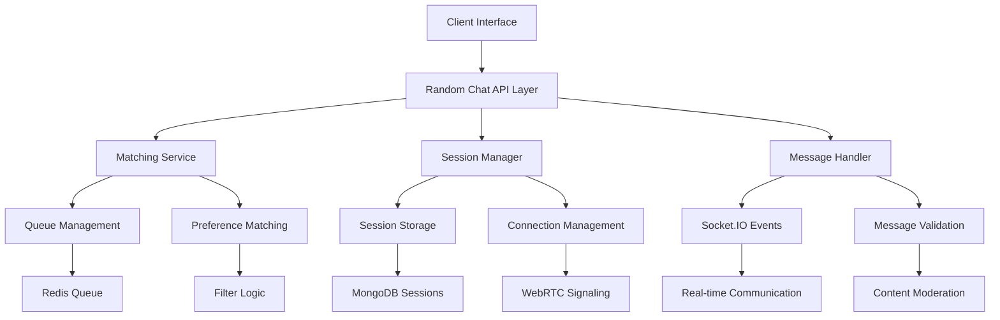
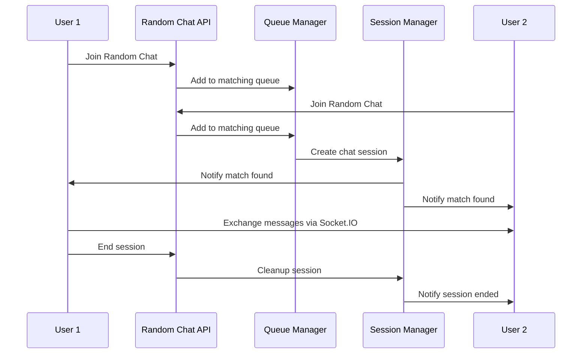
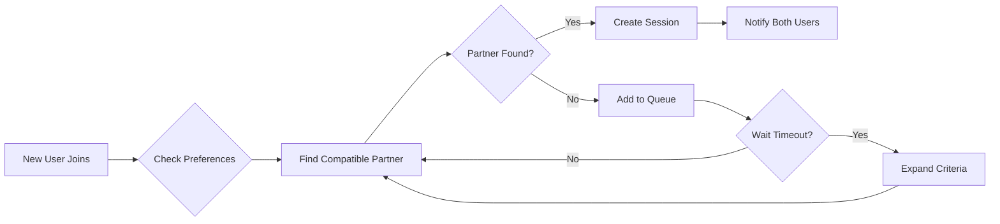

# Random Chat Implementation Design

## Overview

This design document outlines the implementation of an Omegle-like random chat feature for the FriendFinder application. The random chat system will enable authenticated users to connect with random strangers for real-time text messaging, voice, and video calls while maintaining user privacy and safety.

## Architecture

### High-Level System Architecture



### Component Interaction Flow



## Data Models & Schema

### Random Chat Session Model

```typescript
interface IRandomChatSession {
  _id: string
  sessionId: string
  participants: {
    userId: string
    username: string
    anonymousId: string
    joinedAt: Date
    isActive: boolean
  }[]
  status: 'waiting' | 'active' | 'ended' | 'reported'
  chatType: 'text' | 'voice' | 'video'
  preferences: {
    language?: string
    interests?: string[]
    ageRange?: { min: number; max: number }
  }
  messages: {
    messageId: string
    senderId: string
    content: string
    timestamp: Date
    type: 'text' | 'image' | 'system'
  }[]
  metadata: {
    startTime: Date
    endTime?: Date
    duration?: number
    endReason?: 'user_left' | 'partner_left' | 'reported' | 'timeout'
  }
  createdAt: Date
  updatedAt: Date
}
```

### Queue Management Model

```typescript
interface IRandomChatQueue {
  userId: string
  anonymousId: string
  preferences: {
    chatType: 'text' | 'voice' | 'video'
    language?: string
    interests?: string[]
    ageRange?: { min: number; max: number }
  }
  joinedAt: Date
  priority: number
  retryCount: number
  lastMatchAttempt?: Date
}
```

### User Report Model

```typescript
interface IRandomChatReport {
  reporterId: string
  reportedUserId: string
  sessionId: string
  reason: 'spam' | 'inappropriate_content' | 'harassment' | 'fake_profile' | 'other'
  description?: string
  evidence?: {
    messageIds: string[]
    screenshots?: string[]
  }
  status: 'pending' | 'reviewed' | 'resolved' | 'dismissed'
  createdAt: Date
  reviewedAt?: Date
  reviewedBy?: string
}
```

## API Endpoints Reference

### Random Chat Management

#### Join Random Chat Queue
```
POST /api/random-chat/queue
Content-Type: application/json
Authorization: Bearer <token>

Request Body:
{
  "chatType": "text" | "voice" | "video",
  "preferences": {
    "language": "en",
    "interests": ["technology", "music"],
    "ageRange": { "min": 18, "max": 35 }
  }
}

Response:
{
  "success": true,
  "data": {
    "queueId": "queue_123",
    "estimatedWaitTime": 30,
    "position": 5
  }
}
```

#### Leave Queue
```
DELETE /api/random-chat/queue
Authorization: Bearer <token>

Response:
{
  "success": true,
  "message": "Removed from queue successfully"
}
```

#### Get Active Session
```
GET /api/random-chat/session
Authorization: Bearer <token>

Response:
{
  "success": true,
  "data": {
    "sessionId": "session_456",
    "partner": {
      "anonymousId": "anon_789",
      "username": "Anonymous User"
    },
    "status": "active",
    "startTime": "2024-01-15T10:30:00Z",
    "chatType": "text"
  }
}
```

#### End Chat Session
```
POST /api/random-chat/session/end
Authorization: Bearer <token>

Response:
{
  "success": true,
  "message": "Session ended successfully"
}
```

### Reporting System

#### Report User
```
POST /api/random-chat/report
Content-Type: application/json
Authorization: Bearer <token>

Request Body:
{
  "sessionId": "session_456",
  "reason": "inappropriate_content",
  "description": "User sent inappropriate messages",
  "messageIds": ["msg_123", "msg_124"]
}

Response:
{
  "success": true,
  "data": {
    "reportId": "report_789",
    "status": "pending"
  }
}
```

## Business Logic Layer

### Matching Algorithm

The matching system uses a multi-criteria approach:

1. **Primary Matching**: Users are matched based on availability and chat type preference
2. **Secondary Filtering**: Apply user preferences (language, interests, age range)
3. **Fallback Strategy**: If no perfect match found within 60 seconds, expand criteria
4. **Load Balancing**: Distribute users across multiple queue segments

### Queue Management Strategy



### Session Lifecycle Management

1. **Session Creation**: Generate unique session ID, create anonymous identities
2. **Active Monitoring**: Track message frequency, connection status
3. **Timeout Handling**: Auto-end sessions after 30 minutes of inactivity
4. **Graceful Termination**: Clean up resources, notify participants

### Privacy & Safety Measures

1. **Anonymous Identity Generation**: Create temporary usernames (e.g., "Stranger1", "Stranger2")
2. **Message Content Filtering**: Block inappropriate content using keyword filters
3. **Rate Limiting**: Prevent spam (max 10 messages per minute)
4. **User Reporting**: Quick report mechanism with automated review
5. **Session Logging**: Store minimal data for moderation (auto-delete after 7 days)

## Real-Time Communication

### Socket.IO Event Architecture

#### Client → Server Events
```typescript
interface ClientToServerEvents {
  // Queue management
  'random-chat:join-queue': (preferences: ChatPreferences) => void
  'random-chat:leave-queue': () => void
  
  // Session management
  'random-chat:message-send': (data: {
    sessionId: string
    content: string
    type: 'text' | 'image'
  }) => void
  'random-chat:typing-start': (sessionId: string) => void
  'random-chat:typing-stop': (sessionId: string) => void
  'random-chat:end-session': (sessionId: string) => void
  
  // WebRTC for voice/video
  'random-chat:webrtc-offer': (data: WebRTCOffer) => void
  'random-chat:webrtc-answer': (data: WebRTCAnswer) => void
  'random-chat:webrtc-ice-candidate': (data: ICECandidate) => void
}
```

#### Server → Client Events
```typescript
interface ServerToClientEvents {
  // Queue updates
  'random-chat:queue-position': (data: { position: number; estimatedWait: number }) => void
  'random-chat:match-found': (data: SessionData) => void
  
  // Session events
  'random-chat:message-received': (message: ChatMessage) => void
  'random-chat:partner-typing': () => void
  'random-chat:partner-stopped-typing': () => void
  'random-chat:partner-left': () => void
  'random-chat:session-ended': (reason: EndReason) => void
  
  // WebRTC events
  'random-chat:webrtc-offer-received': (offer: WebRTCOffer) => void
  'random-chat:webrtc-answer-received': (answer: WebRTCAnswer) => void
  'random-chat:webrtc-ice-candidate-received': (candidate: ICECandidate) => void
}
```

## Frontend Architecture

### Component Hierarchy

```
RandomChatPage
├── RandomChatHeader
│   ├── ConnectionStatus
│   └── ChatControls
├── QueueInterface
│   ├── PreferencesSelector
│   ├── QueueStatus
│   └── CancelButton
├── ChatInterface
│   ├── MessageList
│   ├── MessageInput
│   ├── TypingIndicator
│   └── ChatActions
├── VideoCallInterface (for video chat)
│   ├── LocalVideo
│   ├── RemoteVideo
│   └── CallControls
└── ReportModal
    ├── ReportForm
    └── SubmitButton
```

### State Management Strategy

Using React Context for global random chat state:

```typescript
interface RandomChatContextType {
  // Queue state
  isInQueue: boolean
  queuePosition: number
  estimatedWaitTime: number
  
  // Session state
  activeSession: RandomChatSession | null
  messages: ChatMessage[]
  isTyping: boolean
  partnerTyping: boolean
  
  // Connection state
  isConnected: boolean
  connectionError: string | null
  
  // Actions
  joinQueue: (preferences: ChatPreferences) => void
  leaveQueue: () => void
  sendMessage: (content: string) => void
  endSession: () => void
  reportUser: (reason: string, description: string) => void
}
```

### Responsive Design Approach

#### Mobile-First Implementation
- **Queue Interface**: Full-screen modal with preference selection
- **Chat Interface**: Full-screen with bottom message input
- **Navigation**: Floating action button for quick actions

#### Desktop Enhancement
- **Split Layout**: Queue status sidebar + main chat area
- **Picture-in-Picture**: Video calls in resizable window
- **Keyboard Shortcuts**: Enter to send, Escape to end session

## Integration with Existing System

### Authentication Requirements
- Users must be logged in to access random chat
- Use existing NextAuth.js session management
- Generate temporary anonymous identities per session

### Socket.IO Integration
Extend existing Socket.IO server with random chat namespaces:

```typescript
// Add to existing socketServer.ts
const randomChatNamespace = io.of('/random-chat')

randomChatNamespace.use(authMiddleware) // Reuse existing auth
randomChatNamespace.on('connection', (socket) => {
  // Handle random chat events
})
```

### Database Integration
- Extend existing MongoDB connection
- Add new collections: `randomchatsessions`, `randomchatqueue`, `randomchatreports`
- Implement TTL indexes for automatic cleanup

### Navigation Integration
Add random chat to existing dashboard navigation:

```typescript
const navigation = [
  // ... existing items
  { 
    name: "Random Chat", 
    href: "/dashboard/random-chat", 
    icon: Shuffle 
  },
]
```

## Testing Strategy

### Unit Testing
- **Queue Management**: Test matching algorithms and queue operations
- **Session Management**: Test session lifecycle and cleanup
- **Message Handling**: Test message validation and filtering
- **WebRTC Service**: Test signaling and connection management

### Integration Testing
- **Socket.IO Events**: Test real-time communication flow
- **API Endpoints**: Test all REST API operations
- **Database Operations**: Test CRUD operations and queries
- **Authentication Flow**: Test session creation and validation

### End-to-End Testing
- **Complete User Journey**: Join queue → Match → Chat → End session
- **Multi-user Scenarios**: Test concurrent users and matching
- **Error Scenarios**: Test network failures and reconnection
- **Cross-platform Testing**: Test mobile and desktop interfaces

## Security Considerations

### Data Protection
- **Anonymous Messaging**: No permanent storage of message content
- **User Privacy**: Generate temporary identities, no profile sharing
- **Auto-cleanup**: Delete session data after 7 days
- **Encryption**: All WebSocket communications over WSS

### Content Moderation
- **Real-time Filtering**: Block messages with inappropriate content
- **User Reporting**: Quick reporting mechanism with review queue
- **Automated Flags**: Detect spam patterns and suspicious behavior
- **Rate Limiting**: Prevent abuse with message frequency limits

### Anti-abuse Measures
- **Session Limits**: Max 10 sessions per user per day
- **Cooldown Periods**: 5-minute cooldown between sessions
- **IP Tracking**: Detect and block suspicious IP patterns
- **Device Fingerprinting**: Prevent multiple account abuse

## Performance Optimization

### Scalability Considerations
- **Horizontal Scaling**: Use Redis for queue management across instances
- **Database Sharding**: Shard sessions by date/region
- **CDN Integration**: Serve static assets via CDN
- **WebRTC TURN Servers**: Multiple TURN servers for global reach

### Monitoring & Analytics
- **Queue Metrics**: Average wait time, match success rate
- **Session Analytics**: Duration, message count, end reasons
- **Performance Monitoring**: Response times, error rates
- **User Behavior**: Popular chat types, peak usage times

## Future Enhancements

### Advanced Features
- **Interest-based Matching**: Enhanced algorithm using ML
- **Language Detection**: Auto-detect user language from messages
- **Virtual Backgrounds**: AI-powered background replacement
- **Screen Sharing**: Allow users to share screens during video calls

### Gamification Elements
- **Chat Streaks**: Reward consistent positive interactions
- **Karma System**: Rate interactions to improve matching
- **Achievement Badges**: Unlock badges for milestones
- **Premium Features**: Enhanced matching, longer sessions

### Platform Expansion
- **Mobile Apps**: Native iOS/Android applications
- **Browser Extension**: Quick random chat access
- **API Platform**: Allow third-party integrations
- **Bot Integration**: AI chatbots for entertainment