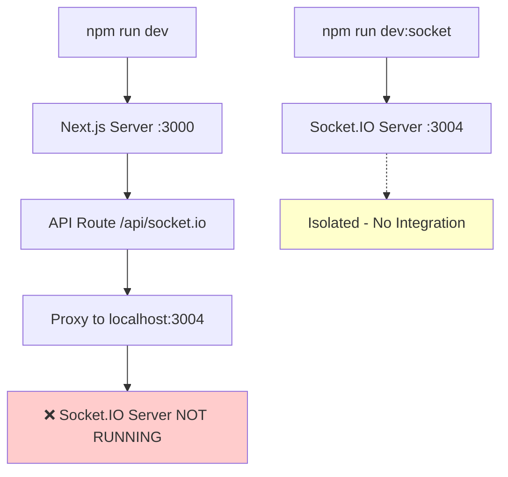
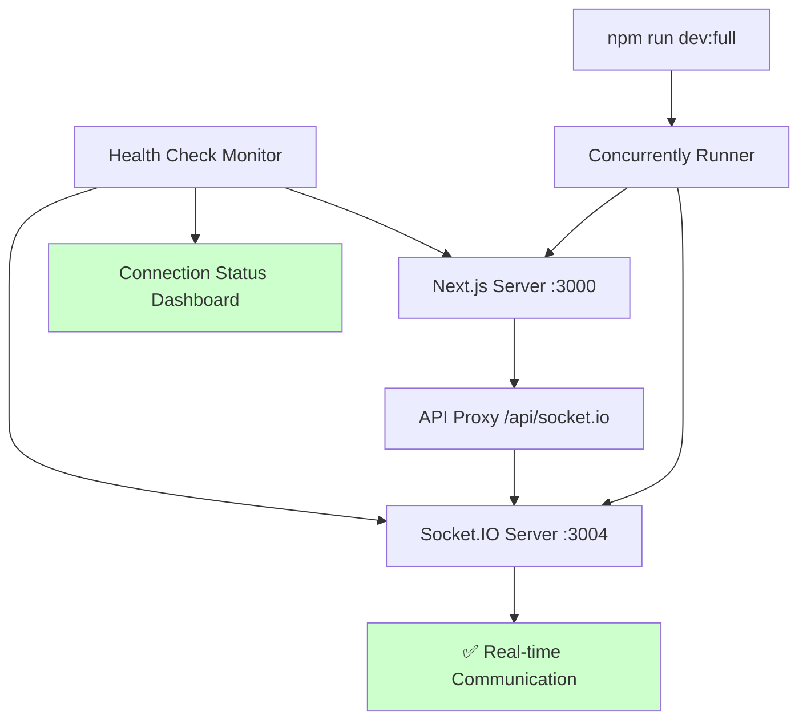
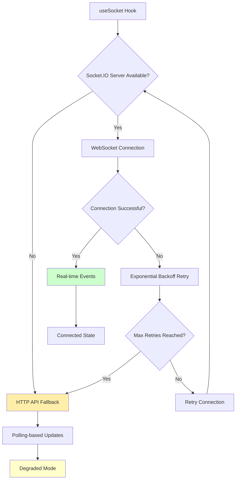
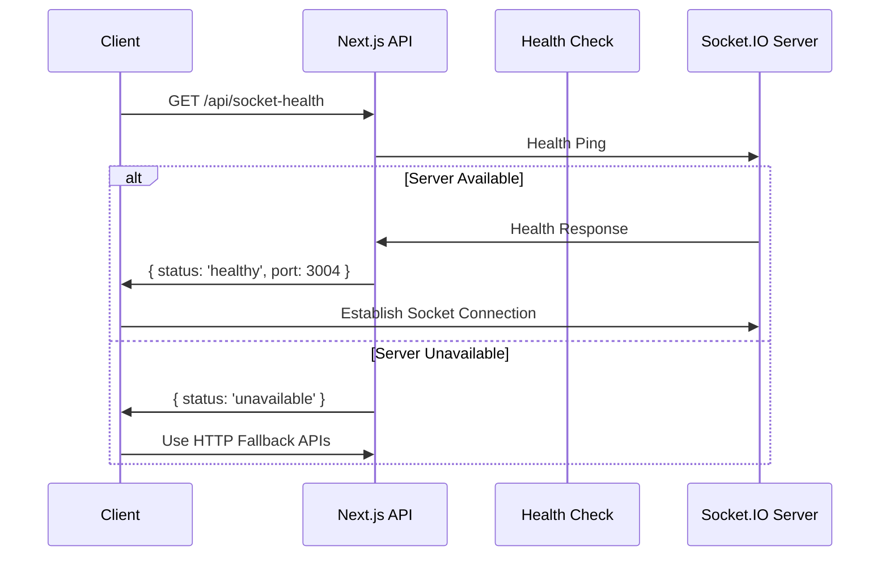
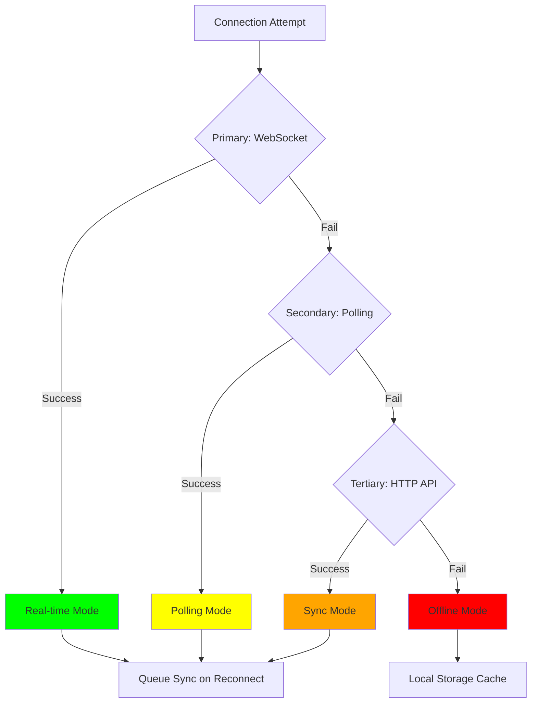
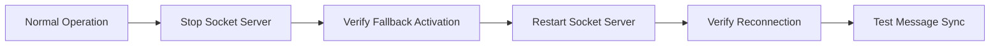
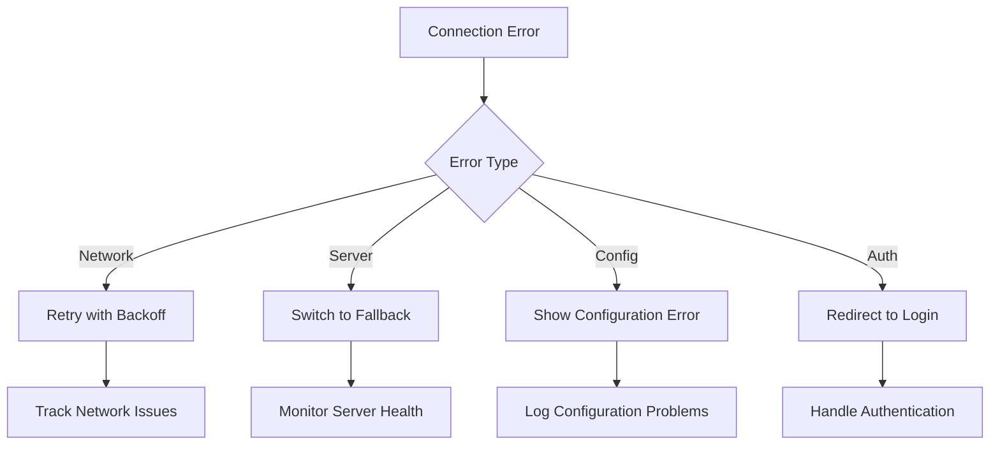

# Socket.IO Connection Issue Resolution

## Overview

This document addresses critical connection failures in the FriendFinder application where Socket.IO requests return 503 errors and React hydration mismatches occur during rendering. The issues stem from incomplete development environment setup and client-server rendering inconsistencies.

## Problem Analysis

### Primary Issues

1. **Socket.IO Server Not Running**: The standalone Socket.IO server (`server.js`) is not started during development, causing 503 Service Unavailable errors
2. **Development Workflow Gap**: The `npm run dev` command only starts Next.js, not the required Socket.IO server on port 3004
3. **React Hydration Mismatch**: Server-rendered HTML doesn't match client-side rendering, particularly in responsive design classes
4. **Connection Error Handling**: Insufficient error recovery mechanisms when Socket.IO server is unavailable

### Error Symptoms

```
GET http://localhost:3000/api/socket.io?EIO=4&transport=polling&t=o5a9zlko 503 (Service Unavailable)
Socket connection error: Error: timeout
WebSocket connection to 'ws://localhost:3000/api/socket.io/?EIO=4&transport=websocket' failed
```

### Architecture Gap



## Architecture Solution

### Enhanced Development Infrastructure



### Connection Management Architecture



## Technical Implementation

### Development Script Enhancement

**Enhanced package.json scripts:**

```json
{
  "scripts": {
    "dev": "next dev",
    "dev:socket": "node server.js",
    "dev:full": "concurrently \"npm run dev\" \"npm run dev:socket\" \"npm run dev:health\"",
    "dev:health": "node scripts/health-monitor.js",
    "start:production": "concurrently \"npm start\" \"npm run dev:socket\""
  }
}
```

### Socket.IO Connection Manager

**Enhanced Connection State Management:**

```typescript
interface ConnectionState {
  status: "disconnected" | "connecting" | "connected" | "fallback" | "failed";
  transport: "websocket" | "polling" | "http-fallback";
  retryCount: number;
  fallbackActive: boolean;
  serverAvailable: boolean;
  lastHealthCheck: Date;
}

interface FallbackMechanism {
  httpPolling: boolean;
  queuedMessages: Message[];
  retryStrategy: "exponential" | "fixed" | "adaptive";
  maxRetries: number;
}
```

### Health Check Integration

**Server Availability Monitoring:**



### Hydration Fix Strategy

**Responsive Design Stabilization:**

```typescript
// Before: Causes hydration mismatch
className="sticky top-0 z-10 flex-shrink-0 flex h-14 sm:h-16"

// After: Hydration-safe approach
const [mounted, setMounted] = useState(false)
useEffect(() => setMounted(true), [])

const baseClasses = "sticky top-0 z-10 flex-shrink-0 flex h-16"
const responsiveClasses = mounted ? "h-14 sm:h-16" : "h-16"
className={`${baseClasses} ${responsiveClasses}`}
```

### Error Recovery System

**Multi-layered Fallback Architecture:**



## Implementation Plan

### Phase 1: Development Infrastructure Fix

1. **Install Concurrency Tool**

   ```bash
   npm install --save-dev concurrently
   ```

2. **Create Health Monitor Script**

   - Monitor both Next.js and Socket.IO servers
   - Automatic restart on failure
   - Connection status dashboard

3. **Update Development Scripts**
   - `npm run dev:full` for complete development environment
   - Health checks integration
   - Clear error messaging

### Phase 2: Socket.IO Connection Enhancement

1. **Enhanced useSocket Hook**

   - Server availability detection
   - Graceful degradation to HTTP APIs
   - Exponential backoff retry logic
   - Connection state persistence

2. **API Fallback Routes**

   - `/api/messages/poll` for message polling
   - `/api/presence/status` for user status
   - `/api/notifications/sync` for notification sync

3. **Message Queue System**
   - Client-side message queuing
   - Automatic sync on reconnection
   - Conflict resolution strategies

### Phase 3: Hydration Fix Implementation

1. **Layout Component Fixes**

   - Client-side responsive class application
   - SSR-safe initial render
   - Theme-aware styling fixes

2. **Component Stabilization**
   - useEffect for dynamic classes
   - suppressHydrationWarning for necessary cases
   - Consistent server/client rendering

### Phase 4: Error Recovery & Monitoring

1. **Connection Health Dashboard**

   - Real-time connection status
   - Performance metrics
   - Error rate monitoring

2. **Automatic Recovery**

   - Background reconnection attempts
   - Service degradation notifications
   - User-friendly error messages

3. **Development Tools**
   - Socket.IO connection debugger
   - Health check visualizer
   - Error reproduction tools

## Testing Strategy

### Connection Resilience Testing



### Test Scenarios

1. **Server Unavailability**

   - Socket.IO server not running
   - Network connectivity issues
   - Server overload conditions

2. **Connection Interruption**

   - Mid-session disconnections
   - Transport downgrades
   - Automatic reconnection

3. **Hydration Consistency**
   - Server-side rendering validation
   - Client-side class application
   - Theme switching scenarios

### Performance Validation

- Connection establishment time < 2 seconds
- Fallback activation time < 1 second
- Message delivery reliability > 99%
- Memory usage optimization
- Error recovery success rate > 95%

## Monitoring and Observability

### Connection Metrics

```typescript
interface ConnectionMetrics {
  uptime: number;
  connectionAttempts: number;
  successfulConnections: number;
  fallbackActivations: number;
  messageDeliveryRate: number;
  averageReconnectionTime: number;
  errorTypes: Record<string, number>;
}
```

### Health Check Endpoints

- `/api/socket-health` - Socket.IO server status
- `/api/connection-metrics` - Real-time connection statistics
- `/api/system-health` - Overall system health

### Error Classification



This comprehensive solution addresses both the immediate Socket.IO connection failures and establishes a robust foundation for real-time communication in the FriendFinder application, ensuring reliable connectivity and graceful degradation when services are unavailable.
