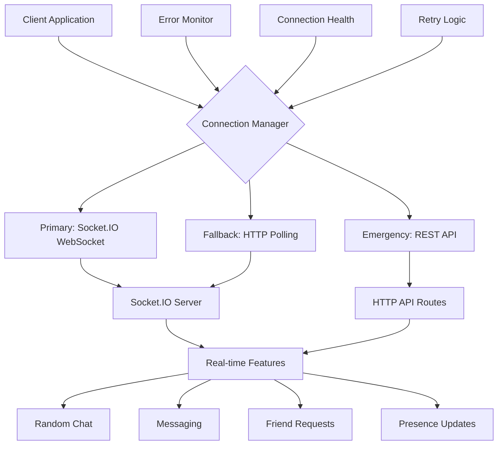
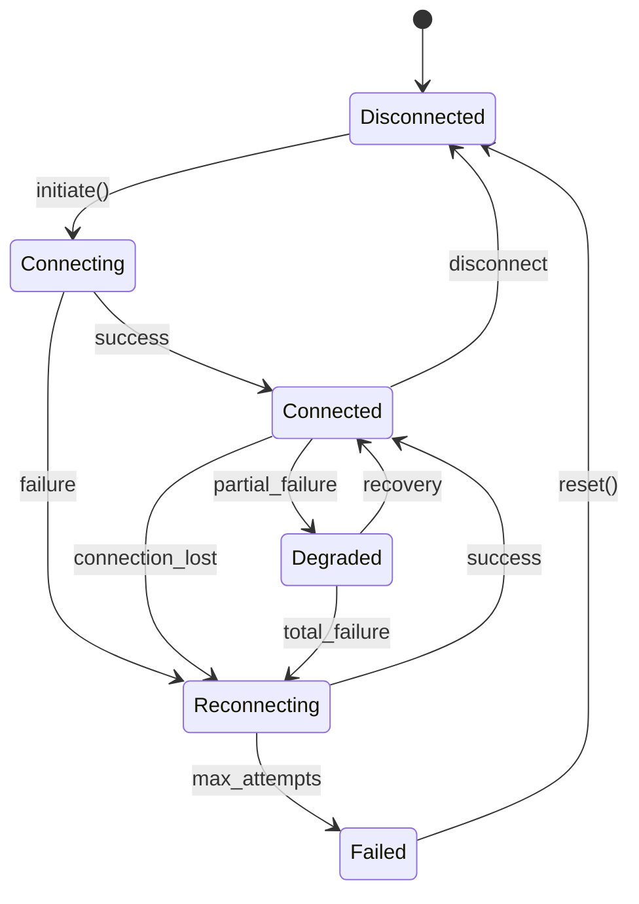
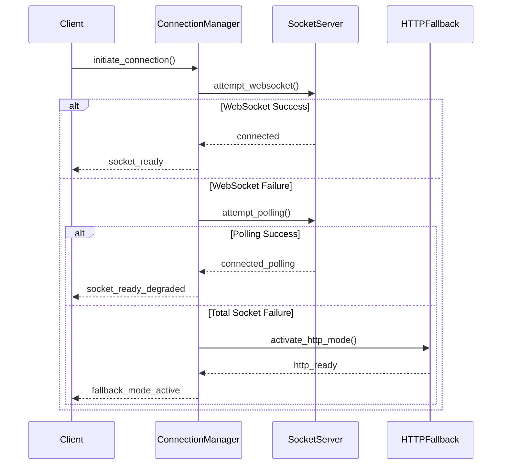
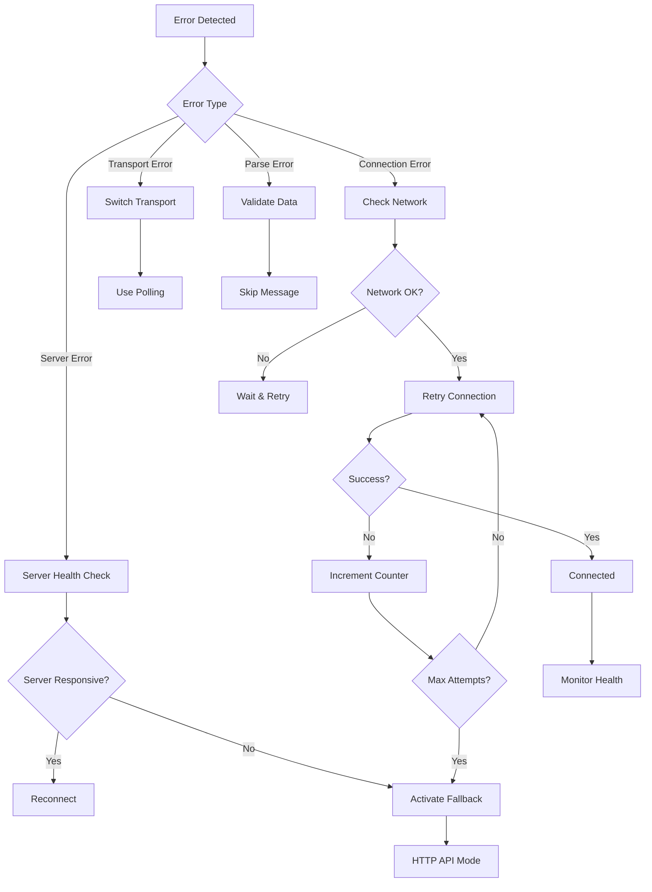
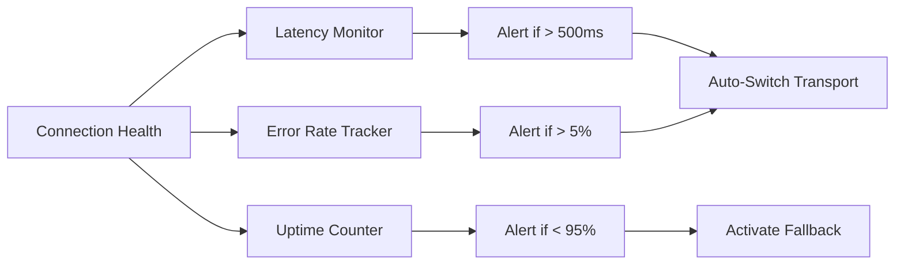

# Socket.IO Error Handling and Connection Management Design

## Overview

This design document addresses the Socket.IO connection errors occurring in the FriendFinder application, specifically the "server error" messages that prevent real-time features from functioning properly. The document provides a comprehensive solution for robust error handling, connection management, and fallback mechanisms for Socket.IO communications.

## Problem Analysis

### Current Issues Identified

1. **Port Configuration Mismatch**

   - Client connecting to port 3002 (`useSocket.ts`)
   - Server running on port 3001 (`server.js`)
   - API route attempting to create separate server instance

2. **Dual Server Architecture Conflict**

   - `server.js` creates a standalone Socket.IO server
   - `/api/socket/route.ts` attempts to create another Socket.IO instance
   - Conflicting configurations causing connection failures

3. **Path Configuration Inconsistency**

   - Client using path: `/api/socket`
   - Server using default path: `/socket.io/`
   - Mismatch prevents proper handshake

4. **Error Handling Inadequacy**
   - Limited error recovery mechanisms
   - No fallback communication methods
   - Insufficient connection state management

## Architecture Design

### Hybrid Communication System



### Connection State Management



## Implementation Strategy

### 1. Unified Server Configuration

**Consolidate to Single Socket.IO Server**

```typescript
// Enhanced server.js configuration
interface ServerConfig {
  primary_port: number;
  socket_port: number;
  fallback_enabled: boolean;
  max_retry_attempts: number;
  heartbeat_interval: number;
}

interface ConnectionHealth {
  status: "healthy" | "degraded" | "failed";
  latency: number;
  last_ping: Date;
  error_count: number;
}
```

**Remove API Route Conflicts**

- Eliminate `/api/socket/route.ts` Socket.IO server creation
- Use API routes only for HTTP fallback communication
- Maintain single source of truth for Socket.IO configuration

### 2. Enhanced Client Connection Management

**Connection Manager Architecture**

```typescript
interface ConnectionManager {
  primary_transport: "websocket" | "polling";
  fallback_transport: "polling" | "http";
  retry_strategy: RetryStrategy;
  health_monitor: HealthMonitor;
  error_recovery: ErrorRecovery;
}

interface RetryStrategy {
  initial_delay: number;
  max_delay: number;
  backoff_multiplier: number;
  max_attempts: number;
  jitter: boolean;
}

interface ErrorRecovery {
  auto_fallback: boolean;
  manual_retry: boolean;
  connection_timeout: number;
  ping_timeout: number;
}
```

**Multi-Transport Support**



### 3. Error Classification and Handling

**Error Types and Responses**

| Error Type        | Cause                 | Recovery Strategy       | Fallback Action        |
| ----------------- | --------------------- | ----------------------- | ---------------------- |
| `ECONNREFUSED`    | Server not running    | Retry with backoff      | HTTP API mode          |
| `ETIMEDOUT`       | Network timeout       | Increase timeout, retry | Polling transport      |
| `server error`    | Server-side exception | Report to server, retry | Queue operations       |
| `transport error` | WebSocket failure     | Switch to polling       | Continue with polling  |
| `parse error`     | Malformed data        | Validate payload        | Skip corrupted message |

**Error Recovery Flow**



### 4. Configuration Standardization

**Environment Configuration**

```typescript
interface SocketConfig {
  // Server Configuration
  SOCKET_SERVER_PORT: number; // 3001
  SOCKET_API_PATH: string; // "/socket.io/"
  SOCKET_CORS_ORIGINS: string[]; // ["http://localhost:3000"]

  // Client Configuration
  SOCKET_CLIENT_URL: string; // "http://localhost:3001"
  SOCKET_CLIENT_PATH: string; // "/socket.io/"
  SOCKET_TRANSPORTS: string[]; // ["websocket", "polling"]

  // Retry Configuration
  SOCKET_RETRY_ATTEMPTS: number; // 5
  SOCKET_RETRY_DELAY: number; // 1000
  SOCKET_TIMEOUT: number; // 10000

  // Health Monitoring
  SOCKET_PING_INTERVAL: number; // 25000
  SOCKET_PING_TIMEOUT: number; // 5000
  SOCKET_HEARTBEAT_INTERVAL: number; // 30000
}
```

**Unified Configuration Management**

```typescript
interface ConfigManager {
  validate_environment(): boolean;
  get_socket_config(): SocketConfig;
  get_fallback_config(): FallbackConfig;
  update_runtime_config(updates: Partial<SocketConfig>): void;
}
```

### 5. Health Monitoring and Diagnostics

**Connection Health Tracking**

```typescript
interface HealthMetrics {
  connection_uptime: number;
  message_success_rate: number;
  average_latency: number;
  error_frequency: number;
  last_successful_ping: Date;
  transport_type: "websocket" | "polling" | "http";
}

interface DiagnosticData {
  client_info: ClientInfo;
  server_info: ServerInfo;
  network_stats: NetworkStats;
  error_history: ErrorEvent[];
}
```

**Real-time Monitoring Dashboard**



### 6. Fallback Communication System

**HTTP API Fallback**

```typescript
interface FallbackAPI {
  send_message(message: MessageData): Promise<boolean>;
  get_pending_messages(userId: string): Promise<MessageData[]>;
  update_presence(userId: string, status: PresenceStatus): Promise<void>;
  poll_for_updates(lastUpdate: Date): Promise<UpdateData[]>;
}

interface MessageQueue {
  queue_outgoing(message: MessageData): void;
  retry_failed(): Promise<void>;
  sync_with_server(): Promise<void>;
  get_queue_status(): QueueStatus;
}
```

**Graceful Degradation Strategy**

| Feature           | Real-time Mode       | Degraded Mode  | Fallback Mode     |
| ----------------- | -------------------- | -------------- | ----------------- |
| Messaging         | Instant delivery     | 2-3s delay     | Polling every 30s |
| Typing indicators | Real-time            | Disabled       | Disabled          |
| Presence updates  | Live status          | 1min intervals | 5min intervals    |
| Friend requests   | Instant notification | 30s delay      | Manual refresh    |
| Random chat       | Immediate matching   | 10s delay      | Queue-based       |

### 7. Error Reporting and Analytics

**Error Tracking System**

```typescript
interface ErrorReporter {
  log_connection_error(error: ConnectionError): void;
  log_message_failure(message: MessageData, error: Error): void;
  track_performance_metrics(metrics: PerformanceMetrics): void;
  generate_diagnostic_report(): DiagnosticReport;
}

interface ErrorAnalytics {
  error_patterns: ErrorPattern[];
  performance_trends: PerformanceTrend[];
  reliability_score: number;
  recommendations: string[];
}
```

## Testing Strategy

### Connection Reliability Testing

**Test Scenarios**

1. **Network Interruption Simulation**

   - Sudden network disconnection
   - Gradual network degradation
   - Intermittent connectivity issues

2. **Server Failure Simulation**

   - Server restart scenarios
   - Server overload conditions
   - Partial service failures

3. **Transport Testing**
   - WebSocket-only environments
   - Polling-only environments
   - Mixed transport scenarios

**Automated Test Suite**

```typescript
interface ConnectionTests {
  test_websocket_fallback_to_polling(): Promise<TestResult>;
  test_server_restart_recovery(): Promise<TestResult>;
  test_network_interruption_handling(): Promise<TestResult>;
  test_message_queue_persistence(): Promise<TestResult>;
  test_error_recovery_mechanisms(): Promise<TestResult>;
}
```

### Performance Testing

**Metrics to Monitor**

- Connection establishment time
- Message delivery latency
- Error recovery time
- Memory usage during retries
- Battery impact on mobile devices

## Security Considerations

### Connection Security

**Authentication Integration**

```typescript
interface SecureConnection {
  validate_session_token(token: string): Promise<boolean>;
  encrypt_sensitive_data(data: any): string;
  rate_limit_connections(userId: string): boolean;
  detect_malicious_patterns(socketId: string): boolean;
}
```

**Error Information Sanitization**

- Prevent sensitive data leakage in error messages
- Sanitize stack traces for client consumption
- Implement secure error reporting mechanisms

### Rate Limiting and Abuse Prevention

**Connection Abuse Protection**

```typescript
interface AbuseProtection {
  connection_rate_limit: number; // Max connections per minute
  error_rate_threshold: number; // Max errors before temporary ban
  retry_backoff_enforcement: boolean; // Enforce client-side backoff
  suspicious_pattern_detection: boolean;
}
```

## Migration Strategy

### Phase 1: Configuration Unification (Week 1)

- Standardize port configurations
- Remove conflicting server instances
- Update client connection parameters

### Phase 2: Enhanced Error Handling (Week 2)

- Implement connection manager
- Add retry mechanisms
- Create error classification system

### Phase 3: Fallback System (Week 3)

- Develop HTTP API fallback
- Implement message queuing
- Add graceful degradation

### Phase 4: Monitoring and Analytics (Week 4)

- Deploy health monitoring
- Implement error analytics
- Create diagnostic tools

## Monitoring and Maintenance

### Operational Metrics

**Key Performance Indicators**

- Connection success rate (target: >99%)
- Average connection time (target: <2s)
- Message delivery success rate (target: >99.5%)
- Error recovery time (target: <10s)

**Alerting Thresholds**

- Connection failure rate >5%
- Average latency >1000ms
- Error recovery time >30s
- Fallback mode activation

### Maintenance Procedures

**Regular Health Checks**

```typescript
interface MaintenanceTasks {
  daily_connection_health_report(): HealthReport;
  weekly_performance_analysis(): PerformanceReport;
  monthly_error_pattern_review(): ErrorAnalysis;
  quarterly_capacity_planning(): CapacityReport;
}
```

This design provides a comprehensive solution for Socket.IO error handling, ensuring reliable real-time communication with robust fallback mechanisms and thorough monitoring capabilities.
