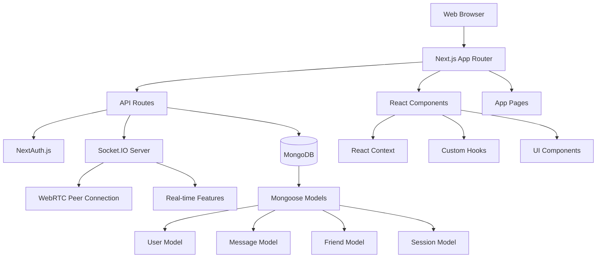
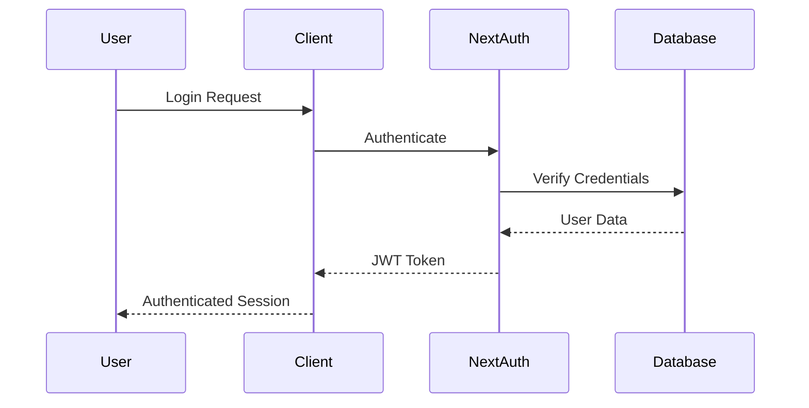
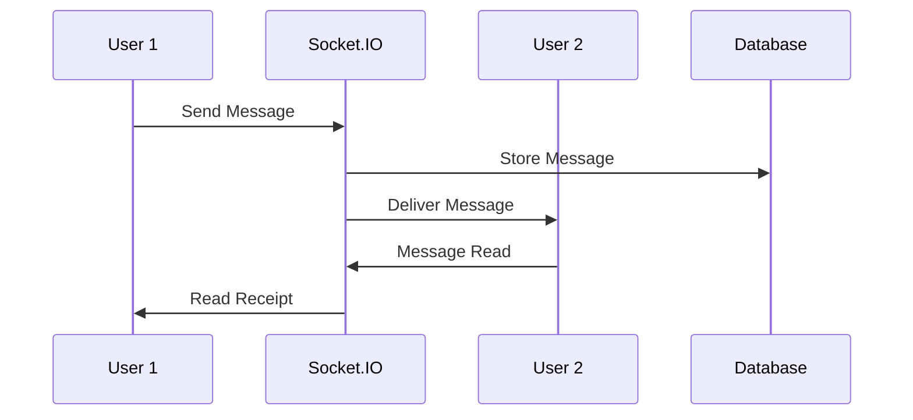

# System Architecture

## Overview

FriendFinder follows a modern full-stack architecture built on Next.js 15 with the App Router pattern. The application combines server-side rendering, client-side interactivity, and real-time communication to deliver a comprehensive social platform.

## Architecture Diagram



## Core Layers

### 1. Presentation Layer

- **React Components**: Modular UI components with TypeScript
- **Pages**: App Router pages with server and client components
- **Styling**: Tailwind CSS with custom design system
- **State Management**: React Context API and custom hooks

### 2. Application Layer

- **API Routes**: RESTful endpoints using Next.js API routes
- **Authentication**: NextAuth.js with custom providers
- **Real-time Communication**: Socket.IO for instant messaging
- **WebRTC**: Peer-to-peer voice and video calling

### 3. Data Layer

- **Database**: MongoDB with Mongoose ODM
- **Models**: Well-defined schemas for all entities
- **Validation**: Input validation and sanitization
- **Caching**: In-memory caching for frequently accessed data

## Project Structure

```
src/
├── app/                    # Next.js App Router
│   ├── api/               # API routes
│   │   ├── auth/          # Authentication endpoints
│   │   ├── users/         # User management
│   │   ├── friends/       # Friend operations
│   │   ├── messages/      # Messaging system
│   │   ├── conversations/ # Chat management
│   │   ├── random-chat/   # Anonymous chat
│   │   └── socket/        # Socket.IO endpoint
│   ├── dashboard/         # Main application pages
│   ├── auth/             # Authentication pages
│   ├── globals.css       # Global styles
│   ├── layout.tsx        # Root layout
│   └── page.tsx          # Landing page
├── components/            # React components
│   ├── ui/               # Base UI components
│   ├── chat/             # Chat components
│   ├── friends/          # Friend management
│   ├── calls/            # Voice/video calling
│   ├── location/         # Location features
│   └── random-chat/      # Anonymous chat
├── context/              # React Context providers
│   ├── AuthContext.tsx
│   ├── FriendsContext.tsx
│   ├── MessagingContext.tsx
│   └── LocationContext.tsx
├── hooks/                # Custom React hooks
├── lib/                  # Utility libraries
│   ├── auth.ts          # Authentication config
│   ├── mongoose.ts      # Database connection
│   ├── socket.ts        # Socket.IO client
│   └── utils.ts         # Helper functions
├── models/              # Mongoose schemas
└── types/               # TypeScript definitions
```

## Component Architecture

### Server Components

- **Pages**: Render on server for better SEO and performance
- **Layouts**: Shared layouts with authentication checks
- **Data Fetching**: Server-side data loading

### Client Components

- **Interactive UI**: Forms, buttons, modals
- **Real-time Features**: Chat, calls, notifications
- **State Management**: Context providers and hooks

### Hybrid Components

- **Progressive Enhancement**: Server-rendered with client hydration
- **Streaming**: Partial rendering for better UX

## Data Flow

### Authentication Flow



### Real-time Messaging Flow



## Security Architecture

### Authentication & Authorization

- JWT-based session management
- Role-based access control
- API endpoint protection
- Client-side route guards

### Data Protection

- Input validation and sanitization
- SQL injection prevention
- XSS protection
- CSRF tokens

### Communication Security

- HTTPS enforcement
- WebSocket secure connections
- End-to-end encryption for calls
- Message content moderation

## Scalability Considerations

### Horizontal Scaling

- Stateless API design
- Database connection pooling
- Load balancer compatibility
- CDN integration

### Performance Optimization

- Code splitting and lazy loading
- Image optimization
- Database indexing
- Caching strategies

### Real-time Scaling

- Socket.IO clustering
- Redis for session storage
- WebRTC TURN servers
- Message queue systems

## Deployment Architecture

### Development Environment

- Local MongoDB instance
- Next.js development server
- Hot module replacement
- Development debugging tools

### Production Environment

- MongoDB Atlas cluster
- Vercel/Render deployment
- Environment-based configuration
- Production monitoring

---

_This architecture provides a solid foundation for the FriendFinder platform while maintaining flexibility for future enhancements and scaling._
