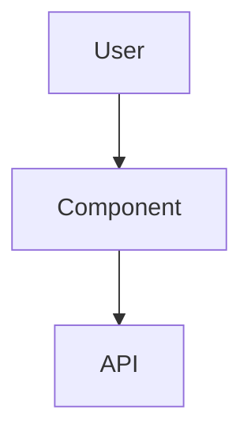

# Qoder Wiki Extraction Guide

## Overview

This guide helps you extract and preserve the comprehensive wiki documentation generated in Qoder IDE's "Repo Wiki Catalog" section.

## 🎯 Quick Extraction Methods

### Method 1: Direct Copy-Paste (Fastest)

1. **Open each wiki section** in the Repo Wiki Catalog
2. **Select all content** (Ctrl+A)
3. **Copy content** (Ctrl+C)
4. **Paste into corresponding markdown files** in the `docs/` folder

### Method 2: Qoder Export Feature

1. **Right-click on "REPO WIKI CATALOG"** panel
2. **Look for "Export" or "Save As"** option
3. **Choose destination folder**: Select your `docs/` directory
4. **Export format**: Choose Markdown (.md) if available

### Method 3: File Menu Export

1. **Go to File menu** in Qoder
2. **Look for "Export Documentation"** or similar
3. **Select wiki sections** to export
4. **Choose output directory**: Your project's `docs/` folder

## 📋 Wiki Sections to Extract

Based on your Qoder catalog, extract these sections:

### Core Documentation

- ✅ **Getting Started** → `01-getting-started.md`
- ✅ **Technology Stack** → `02-technology-stack.md`
- ✅ **Project Structure** → `03-project-structure.md`

### Architecture Documentation

- ✅ **Frontend Architecture** → `04-frontend-architecture.md`
- ✅ **Backend Architecture** → `05-backend-architecture.md`
- ✅ **Component Architecture** → `08-component-architecture.md`

### API & Development

- ✅ **API Endpoints Reference** → `06-api-reference.md`
- ✅ **Real-Time Communication** → `07-realtime-communication.md`
- ✅ **Authentication Flow** → `10-authentication-flow.md`

### Advanced Topics

- ✅ **State Management Integration** → `09-state-management.md`
- ✅ **Data Models & ORM Mapping** → `11-data-models.md`
- ✅ **Middleware & Request Processing** → `12-middleware.md`
- ✅ **Routing & Navigation** → `13-routing-navigation.md`

## 🔄 Step-by-Step Extraction Process

### Step 1: Prepare Directory Structure

```cmd
cd d:\friendfinder
python scripts\extract-qoder-wiki.py
```

This creates template files for all wiki sections.

### Step 2: Extract Content from Qoder

For each section in your Qoder Wiki Catalog:

1. **Click on the section** (e.g., "Frontend Architecture")
2. **Wait for content to load**
3. **Select all content** (Ctrl+A)
4. **Copy** (Ctrl+C)
5. **Open corresponding .md file** in your `docs/` folder
6. **Replace template content** with copied content
7. **Save the file**

### Step 3: Preserve Formatting

When pasting from Qoder:

- **Keep markdown formatting** (headers, lists, code blocks)
- **Preserve code syntax highlighting**
- **Maintain table structures**
- **Keep inline links and references**

### Step 4: Create Downloadable Archive

```cmd
cd d:\friendfinder
scripts\export-docs.bat
```

## 🎨 Content Organization Tips

### Header Structure

```markdown
# Main Section Title

## Subsection

### Details

#### Implementation Notes
```

### Code Blocks

```typescript
// Preserve syntax highlighting
interface UserProps {
  id: string;
  name: string;
}
```

### Tables

| Feature | Description         | Status      |
| ------- | ------------------- | ----------- |
| Auth    | User authentication | ✅ Complete |

### Diagrams

If Qoder includes Mermaid diagrams, preserve them:



## 🚀 Quick Commands

### Extract All at Once

```cmd
# Navigate to project
cd d:\friendfinder

# Create structure
python scripts\extract-qoder-wiki.py

# Manual copy-paste each section from Qoder

# Create archive
scripts\export-docs.bat
```

### Add to Git Repository

```bash
git add docs/
git commit -m "Add comprehensive Qoder wiki documentation"
git push origin main
```

## 🔍 What to Look For in Qoder

### Content Types

- **Architecture diagrams**
- **Code examples**
- **API endpoint documentation**
- **Component hierarchies**
- **Database schemas**
- **Configuration examples**

### Special Elements

- **Syntax-highlighted code blocks**
- **Interactive diagrams**
- **Cross-references between sections**
- **Table of contents**
- **Navigation links**

## 💡 Pro Tips

### Formatting Preservation

1. **Copy in small sections** to maintain formatting
2. **Use "Paste Special"** if available
3. **Check markdown rendering** after pasting
4. **Fix any broken formatting** manually

### Content Validation

1. **Verify all sections copied**
2. **Check code syntax highlighting**
3. **Test internal links**
4. **Ensure images/diagrams included**

### Backup Strategy

1. **Create multiple copies**
2. **Export to different formats** (MD, PDF, HTML)
3. **Store in multiple locations**
4. **Version control with git**

## 🛠️ Troubleshooting

### If Copy-Paste Doesn't Work

- Try copying smaller sections
- Use "Paste as Plain Text" then reformat
- Check for special characters or formatting

### If Content is Missing

- Scroll through entire section in Qoder
- Check for expandable sections
- Look for "Show More" or pagination

### If Formatting is Lost

- Use markdown preview to check
- Manually add markdown syntax
- Refer to original formatting in Qoder

## ✅ Success Checklist

- [ ] All wiki sections extracted from Qoder
- [ ] Content saved in `docs/` folder
- [ ] Markdown formatting preserved
- [ ] Code examples syntax-highlighted
- [ ] Tables and lists properly formatted
- [ ] Archive created with export script
- [ ] Documentation added to git repository
- [ ] Backup created in cloud storage

---

_This guide ensures you can permanently preserve the valuable documentation generated by Qoder IDE's Wiki Catalog feature._
